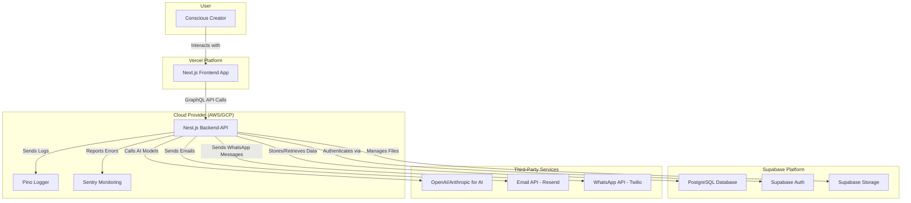

# Alma App Fullstack Architecture Document

## Introduction
This document outlines the complete fullstack architecture for the Alma App, including backend systems, frontend implementation, and their integration. It serves as the single source of truth for AI-driven development, ensuring consistency across the entire technology stack, guided by the principles of Regenerative Marketing and Emotional Design.

**Change Log**

| Date | Version | Description | Author |
| :--- | :--- | :--- | :--- |
| 2025-08-10 | 1.0 | Initial Architecture Draft | Winston (Architect) |

## High Level Architecture

### Technical Summary
The Alma App will be a modern, full-stack TypeScript application built as a modular monolith within a Turborepo monorepo. The frontend will be a server-side rendered (SSR) Next.js application, ensuring a fast and SEO-friendly user experience. The backend will be a robust Nest.js application providing a GraphQL API. Core services like database, authentication, and file storage will be managed by Supabase to accelerate development. The entire infrastructure will be managed via Terraform and deployed using a CI/CD pipeline on GitHub Actions.

### Platform and Infrastructure Choice
*   **Platform:** A combination of Vercel for the Next.js frontend and a container service (like AWS Fargate or Google Cloud Run) for the Nest.js backend, managed by Terraform. Supabase will handle the data layer.
*   **Key Services:**
    *   **Vercel:** Frontend hosting and deployment.
    *   **Supabase:** PostgreSQL Database, Authentication, and Storage.
    *   **AWS/GCP:** Backend hosting, and potentially for future services like dedicated AI model hosting.
*   **Deployment Host and Regions:** US-East to start, with the ability to expand.

### Repository Structure
*   **Structure:** Monorepo.
*   **Monorepo Tool:** Turborepo.
*   **Package Organization:**
    *   `apps/web`: The Next.js frontend application.
    *   `apps/api`: The Nest.js backend application.
    *   `packages/ui`: Shared React components (using MUI).
    *   `packages/types`: Shared TypeScript types and interfaces for API contracts.
    *   `packages/config`: Shared configurations (ESLint, TypeScript, etc.).

### High Level Architecture Diagram


## Tech Stack

| Category | Technology | Version | Purpose |
| :--- | :--- | :--- | :--- |
| Frontend Language | TypeScript | ~5.x | Type safety and scalability. |
| Frontend Framework | Next.js | ~14.x | SSR, routing, and React framework. |
| UI Component Library | MUI | ~5.x | Foundational accessible components. |
| Styling | MUI | ~5.x | Component and styling solution. |
| State Management | Zustand | ~4.x | Simple, lightweight state management. |
| Backend Language | TypeScript | ~5.x | Consistent language across the stack. |
| Backend Framework | Nest.js | ~10.x | Modular and scalable backend architecture. |
| API Style | GraphQL | | Flexible and efficient data fetching. |
| Database | PostgreSQL | Supabase-managed | Relational data storage. |
| File Storage | Supabase Storage | | For user document uploads. |
| Authentication | Supabase Auth | | Secure user management. |
| Frontend Testing | Jest & RTL | Latest | Unit and component testing. |
| Backend Testing | Jest & Supertest | Latest | Unit and integration testing. |
| E2E Testing | Cypress | Latest | End-to-end user flow testing. |
| Build Tool | Turborepo | Latest | Monorepo management. |
| IaC Tool | Terraform | Latest | Infrastructure as Code. |
| CI/CD | GitHub Actions | | Automated builds and deployments. |
| Monitoring | Sentry | | Error tracking and performance. |
| Logging | Pino | | Structured and efficient logging. |

## Data Models

### User
*   **Purpose:** Represents an authenticated user of the platform.
*   **Key Attributes:** `id`, `email`, `created_at`, `primary_language`, `secondary_language`.
*   **Relationships:** Has one Brand Heart, has many Offerings.

### BrandHeart
*   **Purpose:** Stores the core essence of the user's brand.
*   **Key Attributes:** `id`, `user_id`, `mission`, `vision`, `values`, `tone_of_voice` (with fields for both languages).
*   **Relationships:** Belongs to a User.

### Offering
*   **Purpose:** Represents a product, service, or event the user wants to market.
*   **Key Attributes:** `id`, `user_id`, `title`, `description`, `type`, `contextual_notes` (with fields for both languages).
*   **Relationships:** Belongs to a User, can have many Funnels and Content pieces.

### Content
*   **Purpose:** A piece of marketing content generated by the AI.
*   **Key Attributes:** `id`, `offering_id`, `content_body` (bilingual), `status` (Draft, Approved, Scheduled), `scheduled_at`.
*   **Relationships:** Belongs to an Offering.

### Testimonial
*   **Purpose:** Stores customer testimonials.
*   **Key Attributes:** `id`, `offering_id`, `customer_name`, `testimonial_text`.
*   **Relationships:** Belongs to an Offering.

## Unified Project Structure

```
alma-app-monorepo/
├── apps/
│   ├── web/          # Next.js Frontend
│   └── api/          # Nest.js Backend
├── packages/
│   ├── ui/           # Shared MUI Components
│   ├── types/        # Shared TypeScript Interfaces
│   └── config/       # Shared Configurations
├── terraform/        # Terraform IaC files
├── .github/
│   └── workflows/    # GitHub Actions CI/CD
└── package.json      # Root package for Turborepo
```

## Security and Performance

### Security
*   **Authentication:** Handled by Supabase Auth (JWT-based).
*   **Authorization:** Implemented in the Nest.js GraphQL layer (e.g., using guards).
*   **Data:** All sensitive data is encrypted at rest and in transit by Supabase.
*   **File Uploads:** Supabase Storage will be configured with strict policies to only allow authenticated users to upload specific file types.

### Performance
*   **Frontend:** Next.js SSR and Vercel's edge network will ensure fast initial page loads. Images will be optimized using Next/Image.
*   **Backend:** Nest.js is highly performant. Database queries will be optimized, and caching strategies (e.g., Redis) can be added as needed.
*   **API:** GraphQL allows the frontend to request only the data it needs, reducing payload size.
