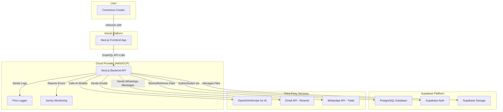

# High Level Architecture

## Technical Summary
The Alma App will be a modern, full-stack TypeScript application built as a modular monolith within a Turborepo monorepo. The frontend will be a server-side rendered (SSR) Next.js application, ensuring a fast and SEO-friendly user experience. The backend will be a robust Nest.js application providing a GraphQL API. Core services like database, authentication, and file storage will be managed by Supabase to accelerate development. The entire infrastructure will be managed via Terraform and deployed using a CI/CD pipeline on GitHub Actions.

## Platform and Infrastructure Choice
*   **Platform:** A combination of Vercel for the Next.js frontend and a container service (like AWS Fargate or Google Cloud Run) for the Nest.js backend, managed by Terraform. Supabase will handle the data layer.
*   **Key Services:**
    *   **Vercel:** Frontend hosting and deployment.
    *   **Supabase:** PostgreSQL Database, Authentication, and Storage.
    *   **AWS/GCP:** Backend hosting, and potentially for future services like dedicated AI model hosting.
*   **Deployment Host and Regions:** US-East to start, with the ability to expand.

## Repository Structure
*   **Structure:** Monorepo.
*   **Monorepo Tool:** Turborepo.
*   **Package Organization:**
    *   `apps/web`: The Next.js frontend application.
    *   `apps/api`: The Nest.js backend application.
    *   `packages/ui`: Shared React components (using MUI).
    *   `packages/types`: Shared TypeScript types and interfaces for API contracts.
    *   `packages/config`: Shared configurations (ESLint, TypeScript, etc.).

## High Level Architecture Diagram

