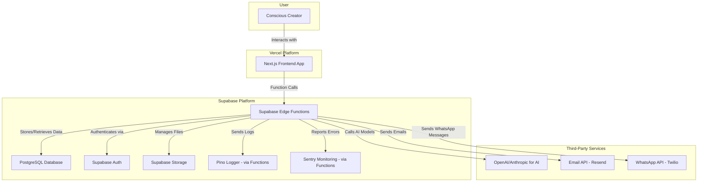

# High Level Architecture

## Technical Summary
The Alma App will be a modern, full-stack TypeScript application. The frontend will be a server-side rendered (SSR) Next.js application, ensuring a fast and SEO-friendly user experience. The backend logic will be handled by Supabase Edge Functions. The entire backend infrastructure, including the database, authentication, and file storage, will be managed by Supabase. The project will be organized in a Turborepo monorepo to manage shared code and configurations.

## Platform and Infrastructure Choice
*   **Platform:** Vercel for the Next.js frontend and Supabase for the entire backend infrastructure.
*   **Key Services:**
    *   **Vercel:** Frontend hosting and deployment.
    *   **Supabase:** PostgreSQL Database, Authentication, Storage, and Edge Functions for backend logic.
*   **Deployment Host and Regions:** US-East to start, with the ability to expand.

## Repository Structure
*   **Structure:** Monorepo.
*   **Monorepo Tool:** Turborepo.
*   **Package Organization:**
    *   `apps/web`: The Next.js frontend application.
    *   `supabase/functions`: Supabase Edge Functions for backend logic.
    *   `packages/ui`: Shared React components (using MUI).
    *   `packages/types`: Shared TypeScript types and interfaces for API contracts.
    *   `packages/config`: Shared configurations (ESLint, TypeScript, etc.).

## High Level Architecture Diagram

