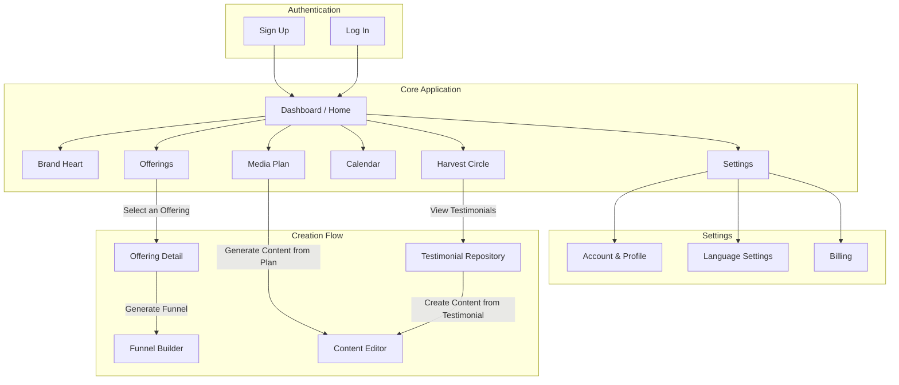
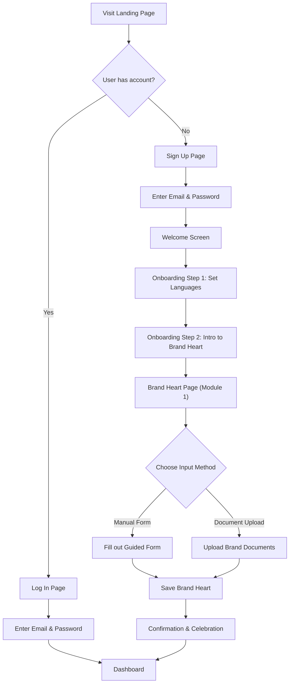

# Alma App UI/UX Specification

## Introduction

This document defines the user experience goals, information architecture, user flows, and visual design specifications for the Alma App's user interface. It serves as the foundation for visual design and frontend development, ensuring a cohesive and user-centered experience that feels calm, creative, and empowering.

### Overall UX Goals & Principles

**Target User Personas**
*   **The Conscious Creator:** A purpose-driven entrepreneur (coach, artist, healer) who values authenticity and is often overwhelmed by traditional marketing. They need tools that feel aligned with their soul and save creative energy.

**Usability Goals**
*   **Ease of Learning:** A new user should be able to define their Brand Heart and generate their first piece of content within 10 minutes.
*   **Efficiency of Use:** Repetitive tasks, like creating content for a new offering, should feel quick and intuitive.
*   **Error Prevention:** The UI will use clear confirmations for important actions and provide gentle guidance to prevent mistakes.
*   **Joyful Experience:** The act of using the app should feel inspiring and nourishing, not like a chore.

**Design Principles**
1.  **Clarity over Cleverness:** Prioritize clear, simple interfaces over complex or novel designs.
2.  **Progressive Disclosure:** Show only what's needed at each step to avoid overwhelming the user.
3.  **Emotional Design:** Use a harmonious aesthetic, thoughtful micro-interactions, and gentle language to create a positive emotional experience.
4.  **AI as a Gentle Guide:** AI suggestions are always presented as drafts, empowering the user as the final decision-maker.
5.  **Accessible by Default:** Design for all users from the start, adhering to WCAG AA standards.

**Change Log**

| Date | Version | Description | Author |
| :--- | :--- | :--- | :--- |
| 2025-08-10 | 1.0 | Initial Draft of UI/UX Specification | Sally (UX) |

## Branding & Style Guide

### Visual Identity
The visual identity of the Alma App will be organic, soulful, and minimalist. The design will evoke a sense of calm and creativity, using soft textures and clean typography to create a digital sanctuary for the user. A key visual element will be the use of subtle, slow-moving **mesh gradients** in soft pastel colors to create a calming, ethereal aura in backgrounds and decorative elements.

### Design System & Technology
To achieve this vision, the UI will be guided by an **Expressive Material Design** philosophy. We will use the **MUI** component library as our foundational system for accessibility, structure, and styling. This provides a robust and flexible design system for a truly bespoke aesthetic. A **dark mode** will be a core feature from the outset.

### Color Palette
The color palette is designed to be soothing and accessible, with a clear distinction between light and dark modes.

**Light Mode**
*   **Primary Background:** Off-white (`#F8F7F4`) - for a soft, calming feel.
*   **Primary Text:** High-contrast Charcoal (`#2E2E2E`) - for readability.
*   **Accent Colors:** A palette of soft pastels for use in mesh gradients, buttons, and highlights (e.g., lavender, soft mint, gentle peach).
*   **Success:** A gentle, muted green.
*   **Warning:** A soft, earthy orange.
*   **Error:** A muted, non-alarming red.

**Dark Mode**
*   **Primary Background:** Deep Charcoal (`#1A1A1A`) - to be easy on the eyes.
*   **Primary Text:** High-contrast Off-white (`#EAEAEA`).
*   **Accent Colors:** The same soft pastels, which will appear more vibrant against the dark background.

### Typography
*   **Primary Font:** A clean, elegant, and highly readable sans-serif font (e.g., Inter, Figtree).
*   **Headings:** Will have a slightly more expressive but still minimalist feel (e.g., a modern serif like "General Sans").
*   **Type Scale:** A clear and harmonious type scale will be used to ensure consistency and readability.

### Iconography
*   **Icon Library:** A set of minimalist, line-art icons that are simple and instantly recognizable.

### Spacing & Layout
*   **Grid System:** A consistent grid system will be used to create a sense of order and harmony.
*   **Spacing:** Generous white space will be used throughout the application to reduce clutter and create a feeling of calm and focus.

## Information Architecture (IA)

### Site Map / Screen Inventory
This diagram shows the primary screens of the application and their relationships.



### Navigation Structure

**Primary Navigation:**
A simple, clean sidebar will be the primary mode of navigation. It will provide direct access to the core modules of the application:
*   Dashboard (Home)
*   Brand Heart (Module 1)
*   Offerings (Module 2)
*   Media Plan (Module 4)
*   Calendar (Module 7)
*   Harvest Circle (Module 8)

**Secondary Navigation:**
*   **Settings:** Accessed via a user profile icon in the corner of the screen, leading to Account, Language, and Billing settings.
*   **Content & Funnel Creation:** These flows are accessed contextually (e.g., by clicking "Generate Funnel" on an Offering), rather than through the main navigation, to keep the primary interface clean and focused.

## Gamification & Joyful UX Elements

To transform the user's journey from a chore into a playful, creative experience, we will incorporate the following elements throughout the app:

*   **Celebratory Micro-interactions:** Every time a user completes a major step (e.g., saving their Brand Heart, approving content, scheduling a post), the interface will respond with a delightful, subtle animation or a positive affirmation. Think of it as the app celebrating their progress with them.
*   **The "Regenerative Cycle" Visual:** The Dashboard will feature a beautiful, interactive visual (perhaps a growing plant, a blooming flower, or a celestial cycle) that represents the 8-module journey. As the user completes each step, the visual progresses, giving them a tangible sense of accomplishment and growth.
*   **Playful Naming & Language:** We will maintain the soulful language ("Offerings," "Cosmic Calendar") throughout the UI. AI suggestions will be framed as "inspirations" or "ideas from the muse," not as commands.
*   **Creative Nudges:** Instead of sterile notifications, the app will offer gentle, inspiring nudges, like "The cosmos is aligned for a new blog post today. Shall we create one?" or "Your audience would love to hear about your [Offering Name]. Ready to craft an invitation?"

## User Flows

### Flow 1: Onboarding & Defining the Brand Heart

**User Goal:** To sign up, set up their account, and provide the foundational information about their brand so the AI can begin to help them.

**Entry Points:**
*   Homepage "Sign Up" button.
*   Direct link to the registration page.

**Success Criteria:**
*   The user has a registered account.
*   The user has set their primary and optional secondary language.
*   The user has successfully saved their core brand information in the "Brand Heart" module.

**Flow Diagram:**


**Edge Cases & Error Handling:**
*   **Sign Up Error:** If the email is already taken, display a clear, friendly error message with a link to the Log In page.
*   **Form Error:** If the Brand Heart form fails to save, preserve the user's input and show a non-alarming "try again" message.

### Flow 2: Creating a "Magic Funnel" & Content Campaign

**User Goal:** To playfully and intuitively bring an "Offering" to life by co-creating a beautiful marketing campaign with their AI partner.

**Entry Points:**
*   "Offerings" page in the main navigation.
*   A "Create New Offering" button on the Dashboard.

**Success Criteria:**
*   The user has created a new "Offering."
*   The user has generated a "Magic Funnel" (landing page and follow-up sequence) for that Offering.
*   The user has generated a strategic Media Plan based on the Offering.
*   The user has generated at least one piece of content from the Media Plan.
*   The user has edited and approved the content.
*   The user has scheduled the approved content on the "Cosmic Calendar."

**Flow Diagram:**
```mermaid
graph TD
    A[Enter the "Offerings" Sanctuary] --> B[Plant a New "Offering" Seed];
    B --> C[Nourish the Seed with Details & Intentions];
    C --> D[Watch the "Offering" Blossom in Your Garden];
    D --> E[View Your Beautiful "Offering"];
    E --> F[Invite the Muse: "Create a Magic Funnel"];
    F --> G[AI Presents a Beautifully Crafted Journey];
    G --> H{Does this journey feel right?};
    H -->|Yes, it's perfect!| I[Visit the "Media Plan" Observatory];
    H -->|A little tweak...| J[Polish the Landing Page];
    J --> I;
    I --> K[Ask the Oracle: "Generate a Content Plan"];
    K --> L[Receive a Constellation of Inspired Ideas];
    L --> M[Choose an Idea to Create];
    M --> N[AI Co-Creates a Content Draft];
    N --> O["Enter the Artisan's Workshop to Add Your Spark"];
    O --> P[Personalize & Refine the Message];
    P --> Q[Approve the Masterpiece];
    Q --> R[Visit the "Cosmic Calendar"];
    R --> S["Place Your Content Among the Stars (Schedule)"];
    S --> T[Success! Your message is ready to manifest.];
```

**Edge Cases & Error Handling:**
*   **AI Generation Failure:** If any AI generation step fails (Funnel, Plan, or Content), display a friendly message asking the user to try again, perhaps suggesting they add more detail to their Brand Heart or Offering.
*   **No Offerings:** If the user navigates to the Media Plan without creating an Offering, the page should have a clear call-to-action guiding them to create their first Offering.